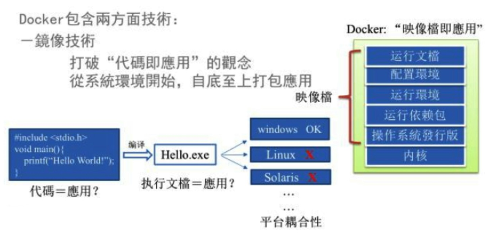
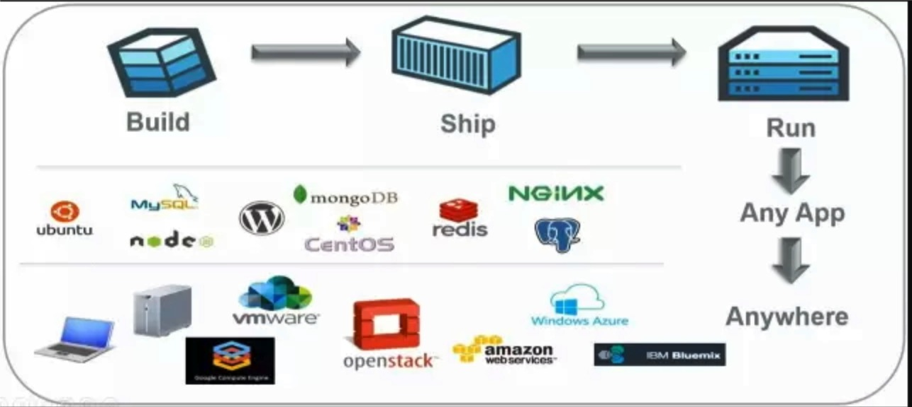
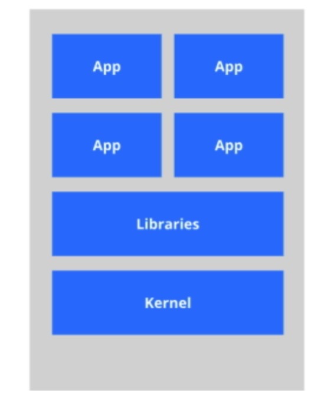
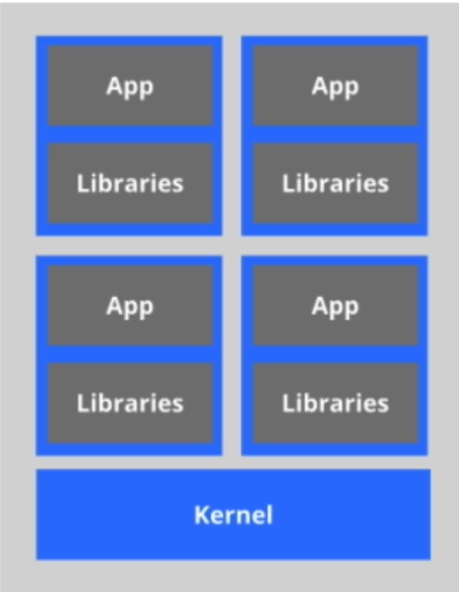
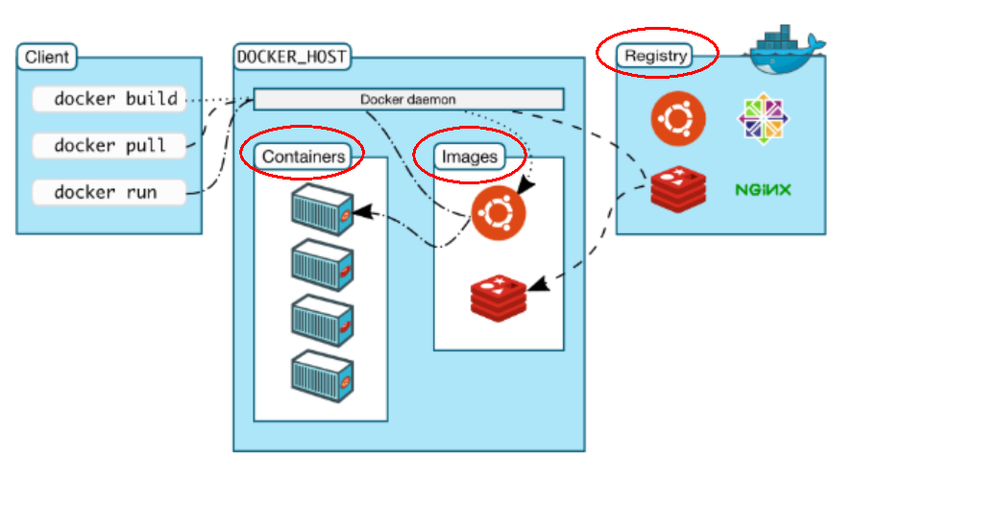
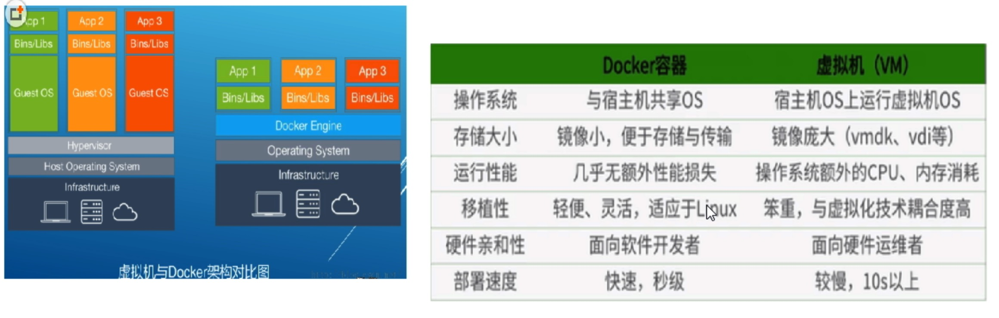

### 1. Docker简介
#### 1. Docker出现原因
1. 软件环境配置比较麻烦, 换一台机器, 就要重新配置一次. Docker可以做到软件可以带环境安装, 即安装的时候, 把原始环境一模一样地复制过来. 开发人员利用Docker可以消除协作编码时"在我的机器上可正常工作"的问题
2. Docker镜像的设计, 使得Docker得以打破过去"程序即应用"的观念. 透过镜像(images)将作业系统核心除外, 运作应用程序所需要的系统环境, 由下而上打包, 达到应用程序跨平台间的无缝接轨运作

#### 2. Docker理念
1. Docker的主要目标是"Securely build, share and run any application, anywhere", 也就是通过对应用组件的封装、分发、部署、运行等生命周期的管理, 使用户的应用程序及其运行环境能够做到"一次封装, 到处运行"
2. Linux 容器技术的出现就解决了这样一个问题, 而 Docker 就是在它的基础上发展过来的. 将应用运行在 Docker 容器上面, 而 Docker 容器在任何操作系统上都是一致的, 这就实现了跨平台、跨服务器. 只需要一次配置好环境, 换到别的机子上就可以一键部署好, 大大简化了操作
3. Docker是一种解决了运行环境和配置问题的软件容器, 方便做持续集成并有助于整体发布的容器虚拟化技术

#### 3.Docker能做什么
1. Virtual Machine虚拟化技术. 虚拟机(virtual machine)就是带环境安装的一种解决方案, 它可以在一种操作系统里面运行另一种操作系统, 比如在Windows 系统里面运行Linux 系统. 应用程序对此毫无感知, 因为虚拟机看上去跟真实系统一模一样, 而对于底层系统来说, 虚拟机就是一个普通文件, 不需要了就删掉, 对其他部分毫无影响. 这类虚拟机完美的运行了另一套系统, 能够使应用程序、操作系统和硬件三者之间的逻辑不变. 虚拟机的缺点:
	1. 资源占用多
	2. 冗余步骤多
	3. 启动慢
2. 容器虚拟化技术. Linux容器(Linux Containers, 缩写为LXC).
**Linux容器不是模拟一个完整的操作系统**, 而是对进程进行隔离. 有了容器, 就可以将软件运行所需的所有资源打包到一个隔离的容器中. 容器与虚拟机不同, 不需要捆绑一整套操作系统, 只需要软件工作所需的库资源和设置. 系统因此而变得高效轻量并保证部署在任何环境中的软件都能始终如一地运行.
3. Docker和传统虚拟化方式的不同之处:
	1. 传统虚拟机技术是虚拟出一套硬件后, 在其上运行一个完整操作系统, 在该系统上再运行所需应用进程
	2. 容器内的应用进程直接运行于宿主的内核, 容器内没有自己的内核, 而且也没有进行硬件虚拟, 因此容器要比传统虚拟机更为轻便
	3. 每个容器之间互相隔离, 每个容器有自己的文件系统, 容器之间进程不会相互影响, 能区分计算资源
4. Docker和传统虚拟化相比的优点
	1. 更快速的应用交付和部署
	2. 更便捷的升级和扩缩容
	3. 更简单的系统运维
	4. 更高效的计算资源利用

### 2. Docker三要素


Docker本身是一个容器运行载体或称之为管理引擎. 我们把应用程序和配置依赖打包好形成一个可交付的运行环境, 这个打包好的运行环境就是image镜像文件. 只有通过这个镜像文件才能生成Docker容器
```
	鲸鱼背上有集装箱:
	蓝色的大海里面 --- 宿主机系统
	鲸鱼 --- Docker
	集装箱 --- 容器实例 from 镜像模板
```

1. image文件可以看作是容器的模板. Docker根据image文件生成容器的实例. 同一个image文件可以生成多个同时运行的容器实例
2. image文件生成的容器实例, 本身也是一个文件, 称为镜像文件
3. 一个容器运行一种服务, 当我们需要的时候, 就可以通过docker客户端创建一个对应的运行实例, 也就是我们的容器
4. 至于仓库, 就是放了一堆镜像的地方, 我们可以把镜像发布到仓库中, 需要的时候从仓库中拉下来就可以了

#### 1.镜像(image)

Docker镜像就是一个只读的模板, 镜像可以用来创建 Docker 容器, 一个镜像可以创建很多容器

#### 2.容器(container)

1. Docker利用容器(Container)独立运行的一个或一组应用. **容器是用镜像创建的运行实例**
2. 容器可以被启动、开始、停止、删除. 每个容器都是相互隔离的, 保证安全的平台. **可以把容器看做是一个简易版的Linux 环境**(包括root用户权限、进程空间、用户空间和网络空间等)和运行在其中的应用程序
3. 容器的定义和镜像几乎一模一样, 也是一堆层的统一视角, 唯一区别在于容器的最上面那一层是可读可写的

#### 3.仓库(repository)

1. 仓库是集中存放镜像文件的场所.仓库(Repository)和仓库注册服务器(Registry)是有区别的. 仓库注册服务器上往往存放着多个仓库, 每个仓库中又包含了多个镜像, 每个镜像有不同的标签(Tag)
2. 仓库分为公开仓库(Public)和私有仓库(Private)两种形式. 最大的公开仓库是Docker Hub(https://hub.docker.com/), 存放了数量庞大的镜像供用户下载. 国内的公开仓库包括阿里云等
3. 阿里云镜像加速: dev.aliyun.com -> 搜索 "容器镜像服务" -> 镜像加速器 获取加速地址

#### 4.Docker运行原理

1. Docker是一个Client-Server结构的系统, Docker守护进程运行在主机上, 然后通过Socket连接从客户端访问, 守护进程从客户端接受命令并管理运行在主机上的容器. 容器, **是一个运行时环境**, 类比于集装箱
2. Docker比传统虚拟机快的原因
	1. docker有着比虚拟机更少的抽象层. 由亍docker不需要Hypervisor实现硬件资源虚拟化, 运行在docker容器上的程序直接使用的都是实际物理机的硬件资源, 因此在CPU、内存利用率上docker将会在效率上有明显优势
	2. docker利用的是宿主机的内核, 而不需要Guest OS, 因此当新建一个容器时, docker不需要和虚拟机一样重新加载一个操作系统内核, 因而避免引寻、加载操作系统内核返个比较费时费资源的过程, 当新建一个虚拟机时, 虚拟机软件需要加载Guest OS, 返个新建过程是分钟级别的. 而docker由于直接利用宿主机的操作系统, 则省略了返个过程, 因此新建一个docker容器只需要几秒钟


#### 5.常用命令

1. 帮助命令
	1. docker info
	2. docker version
	3. docker --help
2. 镜像命令
	1. docker images, 列出本地主机上的镜像, 同一仓库源可以有多个 TAG, 代表这个仓库源的不同个版本, 使用 REPOSITORY:TAG 来定义不同的镜像. 如果不指定一个镜像的版本标签, 例如只使用ubuntu, docker将默认使用 ubuntu:latest 镜像. 各个展示选项说明:
		1. REPOSITORY: 表示镜像的仓库源
		2. TAG: 镜像的标签
		3. IMAGE ID: 镜像ID
		4. CREATED：镜像创建时间
		5. SIZE: 镜像大小
		<br/>
		OPTIONS说明:
		1. -a: 列出本地所有的镜像(含中间映像层)
		2. -q: 只显示镜像ID
		3. --digests: 显示镜像的摘要信息
		4. --no-trunc: 显示完整的镜像信息
	2. docker search IMAGE_NAME, 搜索镜像(https://hub.docker.com), OPTIONS说明:
		1. --no-trunc: 显示完整的镜像描述
		2. -s: 列出收藏数不小于指定值的镜像
		3. --automated: 只列出 automated build类型的镜像
	3. docker pull IMAGE_NAME[:TAG], 下载镜像, 如果不指定TAG, 默认拉取最新版本latest
	4. docker rmi IMAGE_ID[:TAG], 删除镜像
		1. 删除单个: docker rmi -f IMAGE_ID
		2. 删除多个: docker rmi -f IMAGE_ID1:TAG IMAGE_ID2:TAG
		3. 删除全部: docker rmi -f $(docker images -qa)
3. 容器命令
	1. 新建容器: docker create [OPTIONS] IMAGE [COMMAND] [ARG...], 新建容器但并不启动运行
	2. 新建并启动容器: docker run [OPTIONS] IMAGE [COMMAND] [ARGS...], 例: docker run -it centos /bin/bash, 使用镜像centos:latest以交互模式启动一个容器, 在容器内执行/bin/bash命令. OPTIONS说明:
		1. --name CONTAINER_NAME: 为容器指定一个名称
		2. -d: 后台运行容器, 并返回容器ID, 也即启动守护式容器(很重要的要说明的一点: Docker容器后台运行, 就必须有一个前台进程. 容器运行的命令如果不是那些一直挂起的命令(比如运行top, tail)就是会自动退出的. 这个是docker的机制问题, 比如web容器, 我们以nginx为例, 正常情况下, 配置启动服务只需要启动响应的service即可, 例如service nginx start, 但是这样做, nginx为后台进程模式运行, 就导致docker前台没有运行的应用, 这样的容器后台启动后, 会立即自杀因为他觉得他没事可做了.所以, 最佳的解决方案是, 将你要运行的程序以前台进程的形式运行)
		3. -i: 以交互模式运行容器, 保证容器的STDIN是开启的, 通常与 -t 同时使用
		4. -t: 为容器重新分配一个伪输入终端, 通常与 -i 同时使用
		5. -P: 随机端口映射
		6. -p: 指定端口映射, 有以下四种格式
			1. ip:hostPort:containerPort
			2. ip::containerPort
			3. hostPort:containerPort
			4. containerPort
	
	3. 列出当前所有正在运行的容器: docker ps [OPTIONS], OPTIONS说明:
		1. -a: 列出当前所有正在运行的容器 + 历史上运行过的
		2. -l: 显示最近创建的容器
		3. -n: 显示最近n个创建的容器
		4. -q: 静默模式, 只显示容器编号
		5. --no-trunc: 不截断输出
	4. 启动容器: docker start 容器ID或者容器名
	5. 重启容器: docker restart 容器ID或者容器名
	6. 停止容器: docker stop 容器ID或者容器名
	7. 强制停止容器: docker kill 容器ID或者容器名
	8. 删除已停止的容器: docker rm 容器ID, 一次性删除多个容器:
		1. docker rm -f $(docker ps -a -q)
		2. docker ps -a -q | xargs docker rm
	9. 退出容器
		1. exit, 容器停止退出
		2. Ctrl + P + Q, 容器不停止退出
	10. 查看容器日志: docker logs 容器ID.  ``` docker run -d centos /bin/sh -c "while true;do echo hello docker;sleep 2;done" ```
		1. -t 是加入时间戳
		2. -f 跟随最新的日志打印
		3. --tail 数字 显示最后多少条
	11. 查看容器内运行的进程: docker top 容器ID
	12. 查看容器内部细节: docker inspect 容器ID
	13. 进入正在运行的容器并以命令行交互. attach: 直接进入容器启动命令的终端, 不会启动新的进程; exec: 是在容器中打开新的终端, 并且可以启动新的进程
		1. docker exec -it 容器ID bashShell, 例: docker exec -it CONTAINER /bin/bash
		2. 重新进入docker attach 容器ID
	14. 从容器内拷贝文件到主机上: docker cp 容器ID:容器内路径 目的主机路径