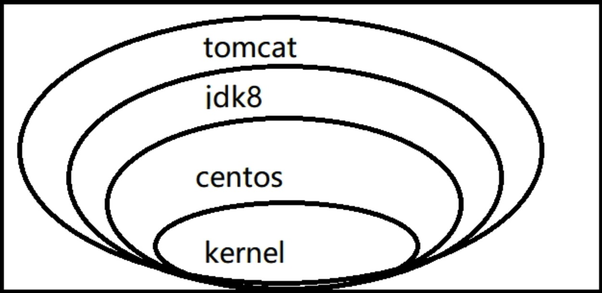
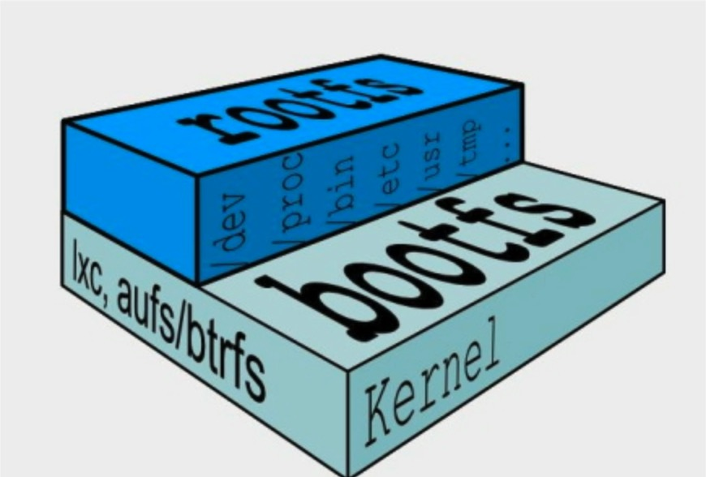
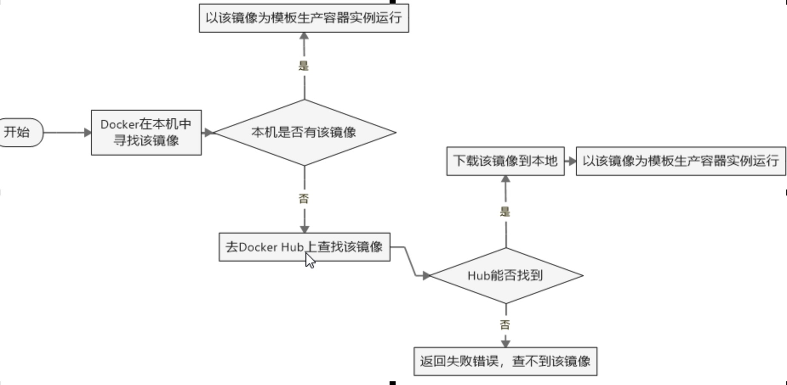
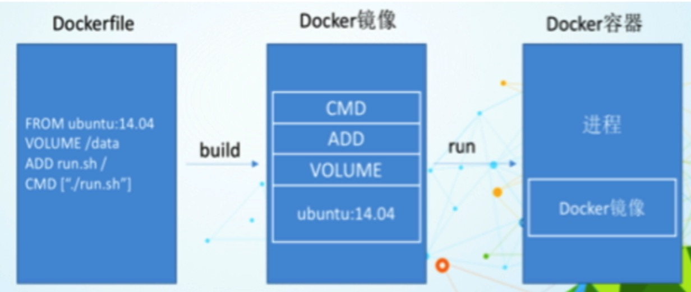
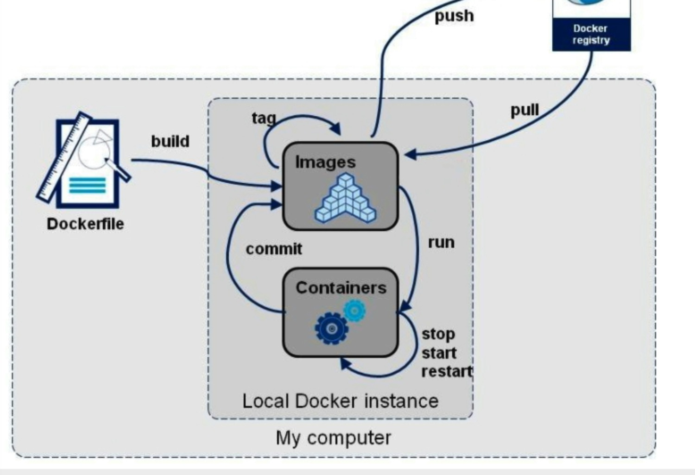

### 1. Docker简介
#### 1. Docker出现原因
1. 软件环境配置比较麻烦, 换一台机器, 就要重新配置一次. Docker可以做到软件可以带环境安装, 即安装的时候, 把原始环境一模一样地复制过来. 开发人员利用Docker可以消除协作编码时"在我的机器上可正常工作"的问题
2. Docker镜像的设计, 使得Docker得以打破过去"程序即应用"的观念. 透过镜像(images)将作业系统核心除外, 运作应用程序所需要的系统环境, 由下而上打包, 达到应用程序跨平台间的无缝接轨运作

#### 2. Docker理念
1. Docker的主要目标是"Securely build, share and run any application, anywhere", 也就是通过对应用组件的封装、分发、部署、运行等生命周期的管理, 使用户的应用程序及其运行环境能够做到"一次封装, 到处运行"
2. Linux 容器技术的出现就解决了这样一个问题, 而 Docker 就是在它的基础上发展过来的. 将应用运行在 Docker 容器上面, 而 Docker 容器在任何操作系统上都是一致的, 这就实现了跨平台、跨服务器. 只需要一次配置好环境, 换到别的机子上就可以一键部署好, 大大简化了操作
3. Docker是一种解决了运行环境和配置问题的软件容器, 方便做持续集成并有助于整体发布的容器虚拟化技术

#### 3.Docker能做什么
1. Virtual Machine虚拟化技术. 虚拟机(virtual machine)就是带环境安装的一种解决方案, 它可以在一种操作系统里面运行另一种操作系统, 比如在Windows 系统里面运行Linux 系统. 应用程序对此毫无感知, 因为虚拟机看上去跟真实系统一模一样, 而对于底层系统来说, 虚拟机就是一个普通文件, 不需要了就删掉, 对其他部分毫无影响. 这类虚拟机完美的运行了另一套系统, 能够使应用程序、操作系统和硬件三者之间的逻辑不变. 虚拟机的缺点:
	1. 资源占用多
	2. 冗余步骤多
	3. 启动慢
2. 容器虚拟化技术. Linux容器(Linux Containers, 缩写为LXC).
**Linux容器不是模拟一个完整的操作系统**, 而是对进程进行隔离. 有了容器, 就可以将软件运行所需的所有资源打包到一个隔离的容器中. 容器与虚拟机不同, 不需要捆绑一整套操作系统, 只需要软件工作所需的库资源和设置. 系统因此而变得高效轻量并保证部署在任何环境中的软件都能始终如一地运行.
3. Docker和传统虚拟化方式的不同之处:
	1. 传统虚拟机技术是虚拟出一套硬件后, 在其上运行一个完整操作系统, 在该系统上再运行所需应用进程
	2. 容器内的应用进程直接运行于宿主的内核, 容器内没有自己的内核, 而且也没有进行硬件虚拟, 因此容器要比传统虚拟机更为轻便
	3. 每个容器之间互相隔离, 每个容器有自己的文件系统, 容器之间进程不会相互影响, 能区分计算资源
4. Docker和传统虚拟化相比的优点
	1. 更快速的应用交付和部署
	2. 更便捷的升级和扩缩容
	3. 更简单的系统运维
	4. 更高效的计算资源利用

### 2. Docker三要素


Docker本身是一个容器运行载体或称之为管理引擎. 我们把应用程序和配置依赖打包好形成一个可交付的运行环境, 这个打包好的运行环境就是image镜像文件. 只有通过这个镜像文件才能生成Docker容器
```
	鲸鱼背上有集装箱:
	蓝色的大海里面 --- 宿主机系统
	鲸鱼 --- Docker
	集装箱 --- 容器实例 from 镜像模板
```

1. image文件可以看作是容器的模板. Docker根据image文件生成容器的实例. 同一个image文件可以生成多个同时运行的容器实例
2. image文件生成的容器实例, 本身也是一个文件, 称为镜像文件
3. 一个容器运行一种服务, 当我们需要的时候, 就可以通过docker客户端创建一个对应的运行实例, 也就是我们的容器
4. 至于仓库, 就是放了一堆镜像的地方, 我们可以把镜像发布到仓库中, 需要的时候从仓库中拉下来就可以了

#### 1.镜像(image)

Docker镜像就是一个只读的模板, 镜像可以用来创建 Docker 容器, 一个镜像可以创建很多容器. 镜像是一种轻量级、可执行的独立软件包, 用来打包软件运行环境和基于运行环境开发的软件, 它包含运行某个软件所需的所有内容, 包括代码、运行时、库、环境变量和配置文件.

1. UnionFS(联合文件系统). Union文件系统是一种分层、轻量级并且高性能的文件系统, 它支持对文件系统的修改作为一次提交来一层层的叠加, 同时可以将不同目录挂载到同一个虚拟文件系统下(unite several directories into a single virtual filesystem). Union文件系统是Docker镜像的基础. 镜像可以通过分层来进行继承, 基于基础镜像可以制作各种具体的应用镜像. 特性: 一次同时加载多个文件系统, 但从外面看起来, 只能看到一个文件系统, 联合加载会把各层文件系统叠加起来, 这样最终的文件系统会包含所有底层的文件和目录
2.  Docker镜像加载原理. Docker的镜像实际上由一层一层的文件系统组成

	1. bootfs(boot file system)主要包含bootloader和kernel, bootloader主要是引导加载kernel, Linux刚启动时会加载bootfs文件系统, **在Docker镜像的最底层是bootfs**. 这一层与我们典型的Linux/Unix系统是一样的, 包含boot加载器和内核. 当boot加载完成之后整个内核就都在内存中了, 此时内存的使用权已由bootfs转交给内核, 此时系统也会卸载bootfs
	2. rootfs(root file system), 在bootfs之上。包含的就是典型 Linux 系统中的 /dev, /proc, /bin, /etc 等标准目录和文件. rootfs就是各种不同的操作系统发行版, 比如Ubuntu、Centos等. 

对于一个精简的OS, rootfs可以很小, 只需要包括最基本的命令、工具和程序库就可以了, 因为底层直接用Host的kernel, 自己只需要提供 rootfs 就行了. 由此可见对于不同的linux发行版, bootfs基本是一致的, rootfs会有差别, 因此不同的发行版可以公用bootfs

3. Docker镜像分层结构: 共享资源. 比如有多个镜像都从相同的 base 镜像构建而来, 那么宿主机只需在磁盘上保存一份base镜像, 同时内存中也只需加载一份 base 镜像, 就可以为所有容器服务了. 而且镜像的每一层都可以被共享
4. Docker镜像都是只读的, 当容器启动时, 一个新的可写层被加载到镜像的顶部. 这一层通常被称作"容器层", "容器层"之下的都叫"镜像层"

#### 2.容器(container)

1. Docker利用容器(Container)独立运行的一个或一组应用. **容器是用镜像创建的运行实例**
2. 容器可以被启动、开始、停止、删除. 每个容器都是相互隔离的, 保证安全的平台. **可以把容器看做是一个简易版的Linux 环境**(包括root用户权限、进程空间、用户空间和网络空间等)和运行在其中的应用程序
3. 容器的定义和镜像几乎一模一样, 也是一堆层的统一视角, 唯一区别在于容器的最上面那一层是可读可写的

#### 3.仓库(repository)

1. 仓库是集中存放镜像文件的场所.仓库(Repository)和仓库注册服务器(Registry)是有区别的. 仓库注册服务器上往往存放着多个仓库, 每个仓库中又包含了多个镜像, 每个镜像有不同的标签(Tag)
2. 仓库分为公开仓库(Public)和私有仓库(Private)两种形式. 最大的公开仓库是Docker Hub(https://hub.docker.com/), 存放了数量庞大的镜像供用户下载. 国内的公开仓库包括阿里云等
3. 阿里云镜像加速: dev.aliyun.com -> 搜索 "容器镜像服务" -> 镜像加速器 获取加速地址

#### 4.Docker运行原理

1. Docker是一个Client-Server结构的系统, Docker守护进程运行在主机上, 然后通过Socket连接从客户端访问, 守护进程从客户端接受命令并管理运行在主机上的容器. 容器, **是一个运行时环境**, 类比于集装箱
2. Docker比传统虚拟机快的原因
	1. docker有着比虚拟机更少的抽象层. 由亍docker不需要Hypervisor实现硬件资源虚拟化, 运行在docker容器上的程序直接使用的都是实际物理机的硬件资源, 因此在CPU、内存利用率上docker将会在效率上有明显优势
	2. docker利用的是宿主机的内核, 而不需要Guest OS, 因此当新建一个容器时, docker不需要和虚拟机一样重新加载一个操作系统内核, 因而避免引寻、加载操作系统内核返个比较费时费资源的过程, 当新建一个虚拟机时, 虚拟机软件需要加载Guest OS, 返个新建过程是分钟级别的. 而docker由于直接利用宿主机的操作系统, 则省略了返个过程, 因此新建一个docker容器只需要几秒钟


#### 5.常用命令

1. 帮助命令
	1. docker info
	2. docker version
	3. docker --help
2. 镜像命令
	1. docker images, 列出本地主机上的镜像, 同一仓库源可以有多个 TAG, 代表这个仓库源的不同个版本, 使用 REPOSITORY:TAG 来定义不同的镜像. 如果不指定一个镜像的版本标签, 例如只使用ubuntu, docker将默认使用 ubuntu:latest 镜像. 各个展示选项说明:
		1. REPOSITORY: 表示镜像的仓库源
		2. TAG: 镜像的标签
		3. IMAGE ID: 镜像ID
		4. CREATED：镜像创建时间
		5. SIZE: 镜像大小
		<br/>
		OPTIONS说明:
		1. -a: 列出本地所有的镜像(含中间映像层)
		2. -q: 只显示镜像ID
		3. --digests: 显示镜像的摘要信息
		4. --no-trunc: 显示完整的镜像信息
	2. docker search IMAGE_NAME, 搜索镜像(https://hub.docker.com), OPTIONS说明:
		1. --no-trunc: 显示完整的镜像描述
		2. -s: 列出收藏数不小于指定值的镜像
		3. --automated: 只列出 automated build类型的镜像
	3. docker pull IMAGE_NAME[:TAG], 下载镜像, 如果不指定TAG, 默认拉取最新版本latest
	4. docker rmi IMAGE_ID[:TAG], 删除镜像
		1. 删除单个: docker rmi -f IMAGE_ID
		2. 删除多个: docker rmi -f IMAGE_ID1:TAG IMAGE_ID2:TAG
		3. 删除全部: docker rmi -f $(docker images -qa)
	5. docker commit 提交容器副本使之成为一个新的镜像. docker commit -a="joy" -m="msg" a9b92ce79170 joy/demo:1.0
		1. -m="提交的描述信息" -a="作者" CONTAINER_ID 要创建的目标镜像名:[标签名]
	6. docker history IMAGE_ID: 列出镜像的变更历史
3. 容器命令
	1. 新建容器: docker create [OPTIONS] IMAGE [COMMAND] [ARG...], 新建容器但并不启动运行
	2. 新建并启动容器: docker run [OPTIONS] IMAGE [COMMAND] [ARGS...], 例: docker run -it centos /bin/bash, docker run -it -p 8888:8080 tomcat, 使用镜像centos:latest以交互模式启动一个容器, 在容器内执行/bin/bash命令. OPTIONS说明:
		1. --name CONTAINER_NAME: 为容器指定一个名称
		2. -d: 后台运行容器, 并返回容器ID, 也即启动守护式容器(很重要的要说明的一点: Docker容器后台运行, 就必须有一个前台进程. 容器运行的命令如果不是那些一直挂起的命令(比如运行top, tail)就是会自动退出的. 这个是docker的机制问题, 比如web容器, 我们以nginx为例, 正常情况下, 配置启动服务只需要启动响应的service即可, 例如service nginx start, 但是这样做, nginx为后台进程模式运行, 就导致docker前台没有运行的应用, 这样的容器后台启动后, 会立即自杀因为他觉得他没事可做了.所以, 最佳的解决方案是, 将你要运行的程序以前台进程的形式运行)
		3. -i: 以交互模式运行容器, 保证容器的STDIN是开启的, 通常与 -t 同时使用
		4. -t: 为容器重新分配一个伪输入终端, 通常与 -i 同时使用
		5. -P: 随机端口映射
		6. -p: 指定端口映射, 有以下四种格式
			1. ip:hostPort:containerPort
			2. ip::containerPort
			3. hostPort:containerPort
			4. containerPort
	
	3. 列出当前所有正在运行的容器: docker ps [OPTIONS], OPTIONS说明:
		1. -a: 列出当前所有正在运行的容器 + 历史上运行过的
		2. -l: 显示最近创建的容器
		3. -n: 显示最近n个创建的容器
		4. -q: 静默模式, 只显示容器编号
		5. --no-trunc: 不截断输出
	4. 启动容器: docker start 容器ID或者容器名
	5. 重启容器: docker restart 容器ID或者容器名
	6. 停止容器: docker stop 容器ID或者容器名
	7. 强制停止容器: docker kill 容器ID或者容器名
	8. 删除已停止的容器: docker rm 容器ID, 一次性删除多个容器:
		1. docker rm -f $(docker ps -a -q)
		2. docker ps -a -q | xargs docker rm
	9. 退出容器
		1. exit, 容器停止退出
		2. Ctrl + P + Q, 容器不停止退出
	10. 查看容器日志: docker logs 容器ID.  ``` docker run -d centos /bin/sh -c "while true;do echo hello docker;sleep 2;done" ```
		1. -t 是加入时间戳
		2. -f 跟随最新的日志打印
		3. --tail 数字 显示最后多少条
	11. 查看容器内运行的进程: docker top 容器ID
	12. 查看容器内部细节: docker inspect 容器ID
	13. 进入正在运行的容器并以命令行交互. attach: 直接进入容器启动命令的终端, 不会启动新的进程; exec: 是在容器中打开新的终端, 并且可以启动新的进程
		1. docker exec -it 容器ID bashShell, 例: docker exec -it CONTAINER /bin/bash
		2. 重新进入docker attach 容器ID
	14. 从容器内拷贝文件到主机上: docker cp 容器ID:容器内路径 目的主机路径

### 2.Docker容器数据卷

#### 1.Docker容器数据卷

1. 是什么. Docker容器产生的数据，如果不通过docker commit生成新的镜像, 使得数据做为镜像的一部分保存下来, 那么当容器删除后, 数据自然也就没有了. 为了能保存数据在docker中我们使用卷. 有点类似我们Redis里面的rdb和aof文件
2. 能干什么. 
	1. 容器的持久化
	2. 容器间继承+共享数据

	卷就是目录或文件, 存在于一个或多个容器中, 由docker挂载到容器, 但不属于联合文件系统, 因此能够绕过Union File System提供一些用于持续存储或共享数据的特性. 卷的设计目的就是**数据的持久化**, 完全独立于容器的生存周期, 因此Docker不会在容器删除时删除其挂载的数据卷, 特点: 

	1. 数据卷可在容器之间共享或重用数据
	2. 卷中的更改可以直接生效
	3. 数据卷中的更改不会包含在镜像的更新中
	4. 数据卷的生命周期一直持续到没有容器使用它为止
3. 添加命令
	1. 直接命令添加, docker run -it -v /宿主机绝对路径目录:/容器内目录[:ro] 镜像名, :ro指定权限只读不可些. 挂载成功后, 容器与宿主机共享目录, 并且容器停止退出后, 主机修改后数据也是同步的
	2. DockerFile添加. 可在Dockerfile中使用**VOLUME**指令来给镜像添加一个或多个数据卷
		1. VOLUME["/dataVolumeContainer","/dataVolumeContainer2","/dataVolumeContainer3"]
		2. 说明: 出于可移植和分享的考虑, 用-v 主机目录:容器目录这种方法不能够直接在DockerFile中实现, 由于宿主机目录是依赖于特定宿主机的, 并不能够保证在所有的宿主机上都存在这样的特定目录
		3. docker build -f DOCKER_FILE -t IMAGE:TAG WORK_DIR
	3. 查看数据卷是否挂载成功, docker inspect 容器ID, 查看Volumes属性
4. 容器间传递共享(--volumes-from), docker run -it --name dc02 --volumes-from dc01 joy/centos, 容器之间配置信息的传递, 数据卷的生命周期一直持续到没有容器使用它为止

### 3.DockerFile

#### 1.简介

1. Dockerfile是用来构建Docker镜像的构建文件, 是由一系列命令和参数构成的脚本
2. 构建三步骤
	1. 编写Dockerfile文件
	2. docker build
	3. docker run
 3. 基础知识
	1. 每条保留字指令都必须为大写字母且后面要跟随至少一个参数
	2. 指令按照从上到下, 顺序执行
	3. ```#```表示注释
	4. 每条指令都会创建一个新的镜像层, 并对镜像进行提交
 4. 举例centos
 	
 	```
 		FROM scratch
 		ADD centos-7-x86_64-docker.tar.xz /

 		LABEL org.label-schema.schema-version="1.0" \
     		org.label-schema.name="CentOS Base Image" \
     		org.label-schema.vendor="CentOS" \
     		org.label-schema.license="GPLv2" \
     		org.label-schema.build-date="20190305"

		CMD ["/bin/bash"]
 
 	```
 
#### 2.Docker构建过程
 
 1. Docker执行Dockerfile的大致流程
 	1. docker从基础镜像运行一个容器
 	2. 执行一条指令并对容器作出修改
 	3. 执行类似docker commit的操作提交一个新的镜像层
 	4. docker再基于刚提交的镜像运行一个新容器
 	5. 执行dockerfile中的下一条指令直到所有指令都执行完成
2. 总结, 从应用软件的角度来看, Dockerfile、Docker镜像与Docker容器分别代表软件的三个不同阶段:
	1. Dockerfile是软件的原材料
	2. Docker镜像是软件的交付品
	3. Docker容器则可以认为是软件的运行态

	Dockerfile面向开发, Docker镜像成为交付标准, Docker容器则涉及部署与运维, 三者缺一不可, 合力充当Docker体系的基石

	1. Dockerfile, 需要定义一个Dockerfile, Dockerfile定义了进程需要的一切东西. Dockerfile涉及的内容包括执行代码或者是文件、环境变量、依赖包、运行时环境、动态链接库、操作系统的发行版、服务进程和内核进程(当应用进程需要和系统服务和内核进程打交道, 这时需要考虑如何设计namespace的权限控制)等等
	2. Docker镜像, 在用Dockerfile定义一个文件之后, docker build时会产生一个Docker镜像, 当运行 Docker镜像时, 会真正开始提供服务
	3. Docker容器, 容器是直接提供服务的
	
	
 
#### 3.DockerFile保留字

1. FROM: 基础镜像, 当前新镜像是基于哪个镜像的(Base镜像scratch: Docker Hub 中 99% 的镜像都是通过在 base 镜像中安装和配置需要的软件构建出来的)
2. MAINTAINER: 镜像维护者的姓名和邮箱地址
3. RUN: 容器构建时需要运行的命令
4. EXPOSE: 当前容器对外暴露出的端口
5. WORKDIR: 指定在创建容器后, 终端默认登陆的进来工作目录, 一个落脚点
6. ENV: 用来在构建镜像过程中设置环境变量(```ENV MY_PATH /usr/mytest```, 这个环境变量可以在后续的任何RUN指令中使用, 这就如同在命令前面指定了环境变量前缀一样, 也可以在其它指令中直接使用这些环境变量, 比如: ```WORKDIR $MY_PATH```)
7. ADD: 将宿主机目录下的文件拷贝进镜像且ADD命令会自动处理URL和解压tar压缩包
8. COPY: 类似ADD, 拷贝文件和目录到镜像中. 将从构建上下文目录中 <源路径> 的文件/目录复制到新的一层的镜像内的 <目标路径> 位置
	
	```
	COPY src dest
	COPY ["src", "dest"]
	
	```
9. VOLUME: 容器数据卷, 用于数据保存和持久化工作
10. CMD: 指定一个容器启动时要运行的命令. Dockerfile中可以有多个CMD指令, 但只有最后一个生效, CMD会被docker run之后的参数替换
11. ENTRYPOINT: 指定一个容器启动时要运行的命令. ENTRYPOINT的目的和CMD一样, 都是在指定容器启动程序及参数. docker run 之后的参数会被当做参数传递给 ENTRYPOINT 形成新的命令组合
	
	```
	DockerFile:
		ENTRYPOINT [ "curl", "-s", "http://ip.cn" ]
	
	docker run IMAGE -i
	会执行curl -s http://ip.cn -i
	```
	
	
12. ONBUILD: 当构建一个被继承的Dockerfile时运行命令, 父镜像在被子继承后父镜像的onbuild被触发. 

	```
	ONBUILD RUN echo "parent image onbuild..."
	```
